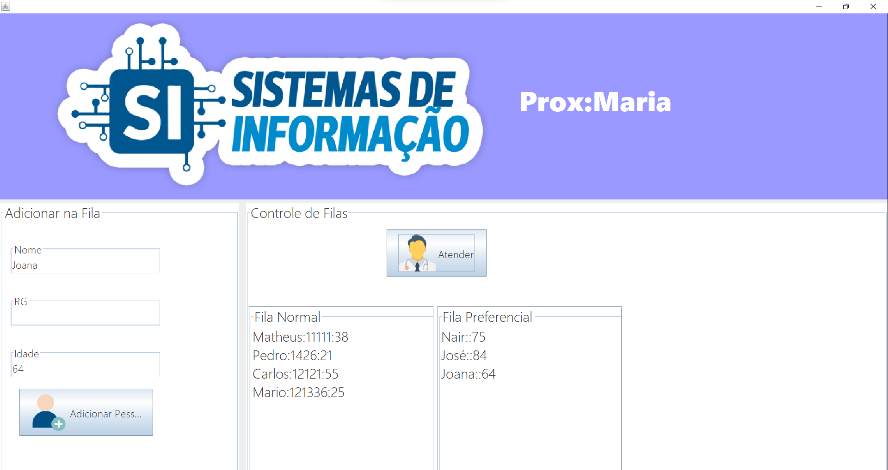

# javaQueue - Sistema de controle da fila de atendimento
### O sistema faz controle da fila de atendimento,  para cada uma pessoa atendida da fila normal, três da fila preferencial maiores que  60 anos serão atendidas, se não tiver ninguém em nehuma das filas, vai mostrar que a fila está vazia.
Linguagem|IDE|Interface
---|---|---
Java|Netbens|Swing
## Sistema funcionando

